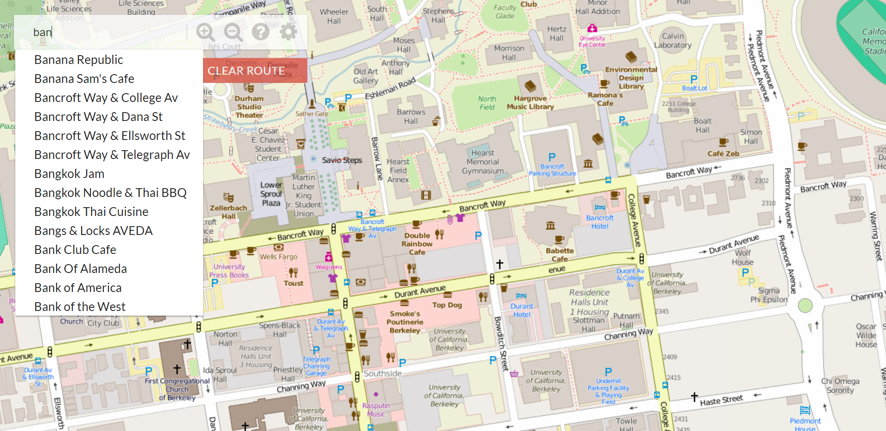

A visualization of restaurant ratings using machine learning and the Yelp academic dataset.

In this visualization, Berkeley is segmented into regions, where each region is shaded by the predicted rating of the closest restaurant (yellow is 5 stars, blue is 1 star). Specifically, the visualization that will be constructed is a Voronoi diagram.

In the resulting map, each dot represents a restaurant. The color of the dot is determined by the restaurant's location. For example, downtown restaurants are colored green. The user that generated this map could have a strong preference for Southside restaurants, and so the southern regions are colored yellow.

Completed for CS61A.
